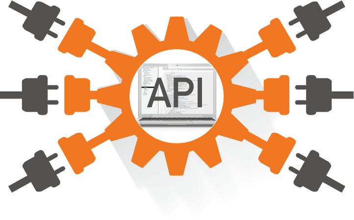
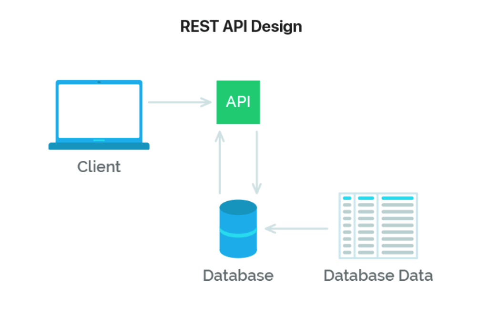
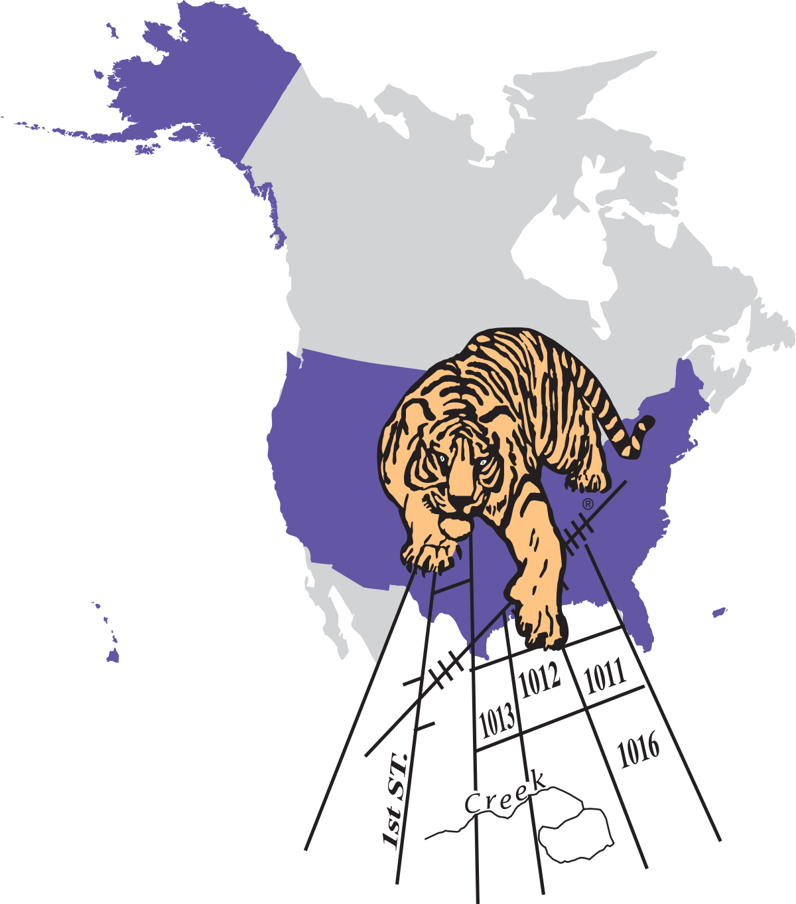
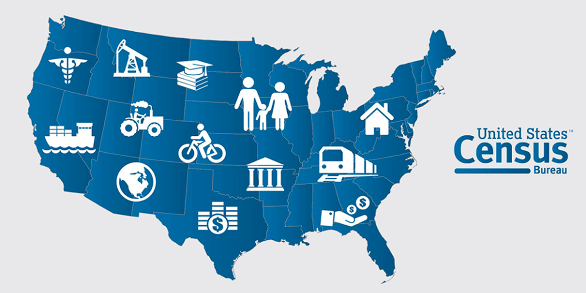

 
========================================================
autosize: true
transition: rotate
transition-speed: slow
<center>
# <b>Reproducible Data Collection:</b><br>
# An Overview of APIs in R<br>
Zach Johnson<br>
December 2nd, 2019</center>


What is an API?
========================================================
- Application Programming Interface
- Allows applications and software to communicate with one another
- The code that governs the access point(s) for the server
- Returns data in response to a request made by a client


***

https://www.sendeasy.co.za/wp-content/uploads/2018/04/api.png


Types of APIs
========================================================
Many different interfaces and communication protocols 
- web-based system
- operating system
- database system
- computer hardware
- software library


Networkable APIs: Web-based system
========================================================
- Web service APIs 
- often an HTTP request sent to a server
- Returns data in JSON or XML format

[](https://sites.psu.edu/annaarsiriy/files/2019/02/Screen-Shot-2019-02-10-at-2.31.08-PM-1p26wa2.png)

***
- The number of public APIs listed on apihound hovers around <b>50,000</b>
[](https://data.world/wp-content/uploads/2017/01/JSON.png)

[](https://www.pngarts.com/files/1/XML-Transparent-Background-PNG.png)


========================================================

<center>
Why use an API? <br>
</center>
- What does this citation tell you?

- What popultion estimate did they use?

- API makes it explicit


R Packages and the CRAN
========================================================
<b>340</b> API wrapper packages<br>
[](https://cran.r-project.org/web/packages/tigris/tigris.pdf)
***
[](https://cran.r-project.org/web/packages/geosapi/geosapi.pdf)
[](https://cran.r-project.org/web/packages/censusapi/censusapi.pdf)
[](https://cran.r-project.org/web/packages/prism/prism.pdf)

Web-based Geoprocessing of Large Gridded Datasets
========================================================
- [Geo Data Portal](https://cida.usgs.gov/gdp/) 
- [geoknife package](http://usgs-r.github.io/geoknife/)


<!--  --> 


========================================================
<center>
# Example: geoknife </center>

```r
library(geoknife)

stencil <- webgeom('state::Texas')
stencil

fabric <- webdata('prism')
fabric

times(fabric) <- c('2000-01-01','2010-01-01')
variables(fabric) <- c('tmx') # maximum temp
fabric

job <- geoknife(stencil, fabric, wait = TRUE) # can have it email you when it is done

data <- result(job) # download data from server

plot(data[,1:2], ylab = variables(fabric))
```


========================================================
<center>
# Questions? </center>
